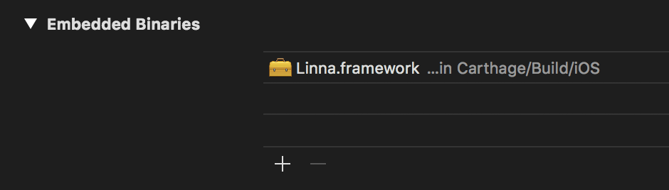

# Linna

[](https://github.com/Scior/Linna)
[](https://travis-ci.org/Scior/Linna)
[](https://swift.org/)
[](https://github.com/Carthage/Carthage)
[](https://coveralls.io/github/Scior/Linna)
[](https://opensource.org/licenses/MIT)
[](https://sonarcloud.io/api/project_badges/measure?project=Scior_Linna&metric=vulnerabilities)
[](https://sonarcloud.io/api/project_badges/measure?project=Scior_Linna&metric=bugs)

----

- [What's this?](#whats-this)
- [Installation](#installation)
- [Usage](#usage)
- [Sample](#sample)
- [License](#license)

## What's this?

**Linna**は、Swift製のシンプルなインターフェースを持つデバッグロガーです。

## Installation

### Carthageでのインストール

- `Cartfile`に以下の行を追加します。

```ruby
github "Scior/Linna"
```

- ルートディレクトリで、`carthage update`を実行します。

- プロジェクトに`Linna.framework`を追加します。



## Usage

### クイックスタート

**Linna**をインポートして、`static`メソッドを呼び出します。

```swift
import Linna

func someFunc() {
    // Sample for the console output with the default format
    Linna.out("Hello!")
}
```

出力は以下のようになります。

```text
2018/12/01 03:25:03 [INFO] [xxx.swift::someFunc():5] Hello!
```

### フォーマットをカスタマイズする

利用可能なパラメーターは以下のようになります。

- `%d`: 日時
- `%obj`: オブジェクト
- `%level`: INFO, ERRORなどのログレベル
- `%file`: ファイル名
- `%func`: メソッド名
- `%line`: 行番号

フォーマットパターンは、以下のメソッドでセットします。

```swift
Linna.setFormatPattern(with: "%d %obj <%level> #%file:%func:%line#")
Linna.out("Hello!")
```

### File output

ファイル出力をする際は、パスを指定します。

```swift
Linna.setFileOutputPath(to: "tmp/hogetaro")
Linna.out("Bye!")
```

ファイルがすでに存在する場合は、追記されます。

### Separate the output explicitly

コンソール出力のみしたい場合は、

```swift
Linna.cout("Console only")
```

もしくは、ファイル出力のみしたい場合は、

```swift
Linna.setFileOutputPath(to: "tmp/hogejiro")
Linna.fout("File only")
```

のように、明示的なメソッドも用意されています。  
標準の出力ストリームは、以下のようにセットできます。

```swift
// Console only
Linna.outputStreams = [.console]
// Console and file
Linna.outputStreams = [.console, .file]
```

## Sample

サンプルアプリはこちらにあります。 [LinnaSampleApp](https://github.com/Scior/Linna/tree/master/LinnaSampleApp).

## License

**Linna**は、MIT Licenseで提供しています。

Copyright (c) 2018 Suita Fujino  
